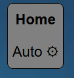
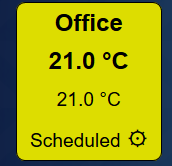

<h1>
    
    ioBroker.evohome
</h1>

[](https://www.npmjs.com/package/iobroker.evohome)
[](https://www.npmjs.com/package/iobroker.evohome)
[](https://david-dm.org/Author/iobroker.evohome)
[](https://snyk.io/test/github/Author/ioBroker.evohome)

[](https://nodei.co/npm/iobroker.evohome/)

**Tests:** Linux/Mac: [](https://travis-ci.org/Author/ioBroker.evohome)
Windows: [](https://ci.appveyor.com/project/Author/ioBroker-evohome/)

# Honeywell EvoHome adapter for ioBroker

Provide an adaptor which can connect to the Honeywell EvoHome cloud, using the `emea` API, so might not work in the US.


The package also includes the free version of the <a href="https://fontawesome.com/">Fontawesome</a> symbol font. See <a href="https://fontawesome.com/license/free">license</a>.

## Instance settings

| Setting       |  Description      |
|---------------|-------------------|
| username      | Your TCC username |
| password      | Your TCC Password |
| simpleTree    | If set, don't include a node for `gateway-controlSystem`. Use this mode if you have only one system, or all your zone names are unique. See below. |


### The `simpleTree` setting.

The data received from the cloud has a data structure like:

`Location/Gateway/ControlSystem/Zone`

Unfortunately, niether the `Gateway` nor `ControlSystem` parts have a
descriptive name, and just have a numeric id.

If you have  `simpleTree` == true, the adaptor will omit the `Gateway/ControlSystem` part, and create
objects like:

`location-name/Zone-name`

e.g.
`Home/Kitchen`

If you have  `simpleTree` == false, the adaptor will include the `Gateway/ControlSystem` part, and create
objects like:

`location_name/gateway_id-controlsystem_id/Zone-name`

e.g.
`Home/12345-6789/Kitchen`

This is not very pretty, so if you have a single Evohome system, you should probably check the box.

# Signals

## Instance Signals
| Signal        | RW | Type   | Description       |
|---------------|----|--------|-------------------|
| `error`       | R  | Bool   | Comms error flag  |
| `errmsg`      | R  | String | Comms error       |

## Control System Signals 
| Signal        | RW | Type   | Description       |
|---------------|----|--------|-------------------|
| status        | R  | JSON   | System status as JSON object    |
| cmd           | RW | JSON   | System command point - write a JSON string here (see below) |


### System Command Examples

#### System Mode Change
```json
{
    "command": "setmode",
    "mode": "Auto",
    "until": "2019-04-13T12:34:00Z"
}
```

Where:
 *    `mode` may be one of `Auto`, `AutoWithReset`, `Custom`, `AutoWithEco`, `Away`, `DayOff` or `HeatingOff`.
 *   `until` sets duration for a temporary setting. It may be omitted.


## Heating Zone Signals
| Signal           | RW | Type   | Description       |
|------------------|----|--------|-------------------|
| `faults`         | R  | String | Zone faults as string |
| `isAvailable`    | R  | Bool   | Zone is available <i>(I assume this means comms with controller is ok... )</i> |
| `schedule`       | R  | JSON   | Zone schedule as JSON |
| `setpoint`       | R  | Number | Current setpoint |
| `force_setpoint` | RW | Number | Set to force setpoint override* |
| `setpointMode`   | R  | String | Current Mode |
| `temperature`    | R  | Number | Current Measured Temperature |
| `zone`           | R  | JSON   | Combined zone status & schedule |
| `zone_cmd`       | RW | JSON   | Zone command point - write a JSON string here (see below) |

### Force Setpoint
A quick way to override a zone. Setting a non-zero number will cause a permanent override to be applied; setting a zero or other "falsey" value will cause any override to be cancelled.


### Zone Command examples

#### Override Temperature

```json
{
    "command": "Override",
    "setpoint": 21.5,
    "until": "2019-04-13T12:34:00Z"
}
```
Where:
 *   `until` sets duration for a temporary setting. It may be omitted.

#### Cancel Override

```json
{
    "command":"CancelOverride"
}
```

#### Set Schehdule

```json
{
    "command": "SetSchedule",
    "schedule": (schedule)
}
```

Where:
 *   `(schedule)` is a a zone schedule object as found in the `.schedule` point. The format of this is set by Honeywell.


# Widgets

## System Widget
 

 * Bind to the control system `Status` point
 * The "cogwheel" &#9881; opens a settings dialog which allows the system mode to be changed.
 * The background colour will change depending on the system state - at present, these are hard-coded:
    * Red - There are system or zone faults
    * Yellow - A zone is overridden
    * Green - A zone is in Eco mode or system is in Away mode
    * Grey - Normal operation
    * Blue - Heating is Off
    * Purple - DayOff or Custom Mode
 * Errors will cause a warning icon to show: &#9888; - This will open a dialog giving more detail.

## Zone Widget


 * Bind to the Zone `zone` point
 * The "cogwheel" &#9881; opens a settings dialog which allows the zone setpoint and schedule to be changed.
 * Errors will cause a warning icon to show: &#9888; - This will open a dialog giving more detail.
 * Colors vary to represent the zone state:
    * The _centre_ represents the actual temperature
    * The _edge_ represents the current setpoint
    * See below for more on colours.
    * If `offSp` is set, setpoints below this value will be suppressed for two-colour blends, and only the `mv` will be used.
 * The setpoint and current temperature formatting can be overridden by use of the `spFormat` and `mvFormat` attributes. The <a href="https://www.npmjs.com/package/sprintf-js">sprintf-js</a> module is used to provide formatting. e.g. `"%.1f"`    
  * Likewise, `modeFormat` allows formatting of the mode string.
  * The widget title is usually extracted from the object id - it can be overridden by the `titleText` attribute.
  * A footer text can be added by setting the `footer` attribute 

_You can use the various text and and formatting overrides to embed additional HTML code within the widget body - useful if you want to add links to other pages, etc_.

### Colour Generation - `colours` and `interpolate`

Colours are generated from a list of switch points and colour codes, e.g.

```json
    $indoor: [
    	{ t:15, b: 0x1E90FF, f:0x0000 },
    	{ t:18, b: 0x0bb000, f:0x0000 },
    	{ t:21, b: 0xdddd00, f:0x0000 },
    	{ t:24, b: 0xff0000, f:0x0000 }
    ],    

    $outdoor: [
    	{ t:8,  b: 0x1E90FF, f:0x0000 },
    	{ t:12, b: 0x00bb00, f:0x0000 },
    	{ t:18, b: 0xdddd00, f:0x0000 },
    	{ t:22, b: 0xff0000, f:0x0000 }
    ],    

```
Where `t` = temperature, `b` = background colour and `f` = foreground colour. The colours MUST be numeric codes. (You can't use colour names like "green" for instance.)

 * The colours can be configured using the `colours` attribute. You can set `$indoor` (the default) `$outdoor` or a custom vector as described below .
 * Setting the `interpolate` attribute means the widget will try to work out intermediate colours if the temperature lies between two values.
 * The default is `$indoor`

#### Custom Colour Vector

```
10 blue
15 green
30 red white
```

If the `colours` attribute does not start with `$`, then it is assumed to be a list of switchpoints and associated colour(s), one per line, with each line having the format:

```
<SwitchValue> <Background> [<Foreground>]
```

 * The switch value should be a number - rows should be in ascending order
 * The colours may be:
   * A HTML colour name
   * A 6 digit hex colour code e.g. #ff55ff
 * The default foreground is black

## Todo
* Internationalisation
* Hot Water support - can't do this as I have no hardware -T
* Other EvoHome devices - can't do this as I have no hardware -T

## Changelog

### 0.0.1
* Taragorm -  initial release

## License
MIT License

Copyright (c) 2019 Taragorm@zoho.eu

Permission is hereby granted, free of charge, to any person obtaining a copy
of this software and associated documentation files (the "Software"), to deal
in the Software without restriction, including without limitation the rights
to use, copy, modify, merge, publish, distribute, sublicense, and/or sell
copies of the Software, and to permit persons to whom the Software is
furnished to do so, subject to the following conditions:

The above copyright notice and this permission notice shall be included in all
copies or substantial portions of the Software.

THE SOFTWARE IS PROVIDED "AS IS", WITHOUT WARRANTY OF ANY KIND, EXPRESS OR
IMPLIED, INCLUDING BUT NOT LIMITED TO THE WARRANTIES OF MERCHANTABILITY,
FITNESS FOR A PARTICULAR PURPOSE AND NONINFRINGEMENT. IN NO EVENT SHALL THE
AUTHORS OR COPYRIGHT HOLDERS BE LIABLE FOR ANY CLAIM, DAMAGES OR OTHER
LIABILITY, WHETHER IN AN ACTION OF CONTRACT, TORT OR OTHERWISE, ARISING FROM,
OUT OF OR IN CONNECTION WITH THE SOFTWARE OR THE USE OR OTHER DEALINGS IN THE
SOFTWARE.
